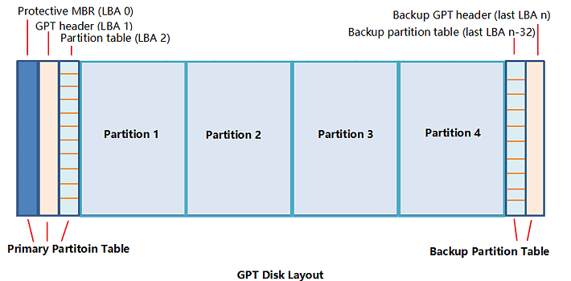
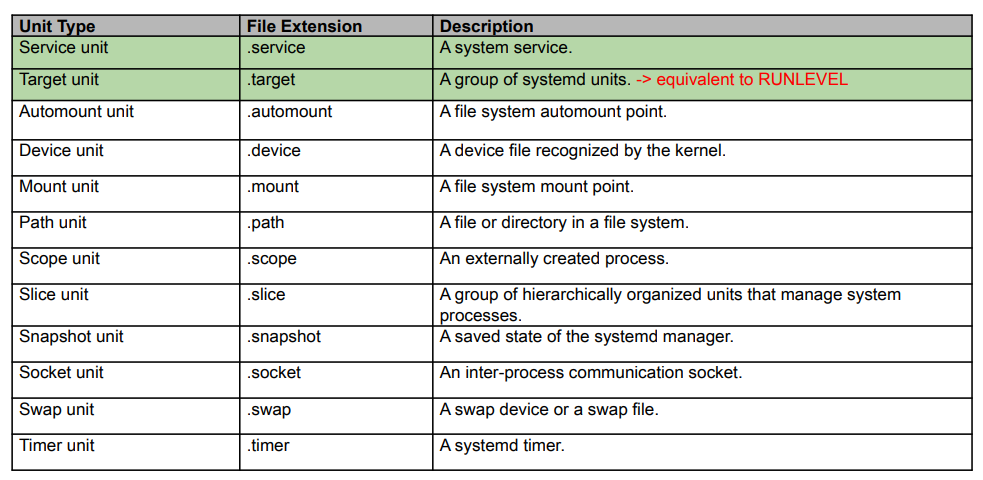
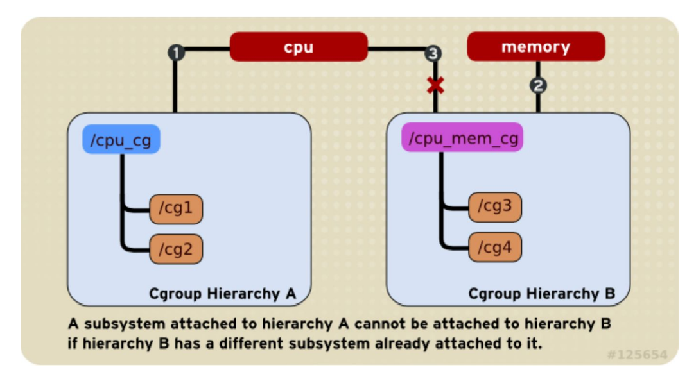
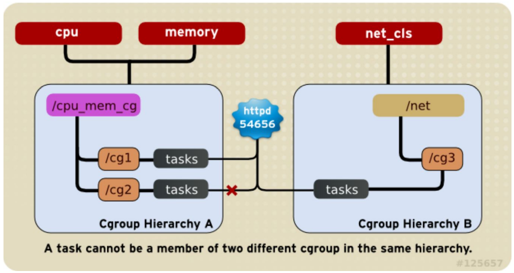

# OS
The Operating System is a Resource Manager and controlls the hardware to garant resources to athe Applications runnin on top of it. 

# Boot 
## Booting process
1) * Läd das `BIOS` vom `ROM`, das BIOS besteht aus verschiedenen hardwarespeziefischen low-level Programmen welche eine Schnittstelle zu den IO-Geräten wie Tastatur, Bildschirm, Festplatten zur verfügung stellen.
    * Wenn das BIOS gestartet wird führt es `POST(Power-On-Self-Test)` aus um geräte zu erkennen dazu scannt es die `PCIE-Busse`
    * Dann wählt es das `boot device` aus einer liste im CMOS
    * Der erste Sektor(`MBR` 512bytes) des `boot device` wird in den speicher geladen und ausgeführt.
2) Der `MBR` enthält informationen über den `bootloader` wählt und führt einen `bootloader` aus. Der `bootloader` läd das Betiebssystem in den speicher und führt es aus(sets regs and the like). 
3)  Kernel stage
    * Der Kernel wird geladen.
    * Der Kernel mounted das root file system in **read only mode**
    * Kernel läd modules welche 
    * Der Kernel frägt das BIOS/system bus um HW-Informationen für jedes gerät zu erhalten und läd die Treiber für diese.
    * Der Kernel initialisiert die Managmentstrukturen wie process tables. 
    * Initilaisiert Process tables, interput sys calls, vram, page cache, resource controll
    * Lädt driver
4) Init stage (system services)
    * Startet den parent process systemd mit PID 1
    * remounts das Root file system in **read write mode**
    * Konfiguriert das system 
    * startet verschiedene Prozesse wie selinux netzwerk etc. 
    * setzt das system in einen `Runlevel`

## Bootloader
Ist eine Anwendung/Software welche vom BIOS/UEFI gestartet wird und dafür verantwortlich ist das der `Kernel` geladen wird.\
Bios muss den Kernel mittles intramfs images benutzten können. Ass heist es muss auf `/boot` zugriff haben und damit alles unterstützen was dafür benötigt wird (LVM,RAID,dm-crypt, LUKS etc.)\
UEFI kann den kernel selbst direkt laden.

## MBR (GRUB) mit BIOS [https://www.akadia.com/services/dual_boot.html]
* Der MBR ist auf den ersten 512 bytes des boot-device. Von ihnen sind die ersten 446 bytes sind reserviert für bootloader informationen. die nächsten 64 bytes sind für die Parititions Tabellen, die letzen 2 bytes sind die Magic numbers welche benutzt werden um einen Validation check für den MBR durchzuführen im falle eines Interrupts. 
* Der GRBU bootloader unterstützt `Chain-Loading` was ermöglicht nicht unterstütze Betriebssysteme laufen zu lassen. In diesem falle wird einfach nach GRUB der 2e Bootloader ausgeführt welcher von einer anderen Partition bootet. 


## UEFI [https://www.happyassassin.net/posts/2014/01/25/uefi-boot-how-does-that-actually-work-then/]
`Unified Extensible Firmware Interface` unterstützt das lesen von Parititonstabellen und File systems. Es führt keinen code des `MBR` anstelle führt es code vom `NVRAM (Non-volatile random-access memory)` aus.\
Ist eine Architektur unabhängige VM welche speziell für sie kompilierte `EFI` binaries ausführen kann.\
UEFI führt `EFI` Anwendungen aus wie z.B. `boot loader, boot managers, UEFI shells` etc aus. Diese Anwendungen werden in der EFI partition des systems gespeichert. 
`/EFI/vendor_name` sie werden ausgeführ tin dem man einen boot entry im NVRAM anlegt.\
Am Ende wird aber auch EFI einen bootloader ausführen oder den Kernel selbst mit EFISTUB.\
Weil UEFI einfach verschiedene EFI Anwendungen ausführen kann muss kein boot-loader-chaining durcheführt werden um verschiedene OS zu starten.

## GPT
Ersatz für MBR, kann mehr als 2tb grosse paritionen verwalten. MBR header scheint aus legacy Gründen vorhanden zu sein. Auf dem GPT sind auch die infromationen wo der zu bootended Kernel liegt und beim kernel liegt auch die `inital ram disk` der `bootloader` dekomprimiert den kernel und läd die inital ram disk (welche die kernelmodule udn spezielle devie-special files beinhaltet wie etwas /dev/null)in den ram, der Kernel mounted diese dan als filesystem und startet. Jetzt kann der kernel das reguläre file system finden und dieses booten.\

### Runlevel

| ID | Name                                                                  | Description                                                                |
|----|-----------------------------------------------------------------------|----------------------------------------------------------------------------|
| 0  | Halt                                                                  | Shuts down the system                                                      |
| 1  | Single-user mode                                                      | Mode for adminstrative tasks                                               |
| 2  | Mulit-user mode                                                       | Does not configure network interfaces and does not export network services |
| 3  | Multi-user mode  with networking                                      | Starts the system normally                                                 |
| 5  | Not used/user-definable                                               | For special purposes                                                       |
| 5  | Start the system nromally with appropriate display manager (with GUI) | same as runlevel 3 + display  manager                                      |
| 6  | Reboot                                                                | Reboots the system                                                         |

## [Systemd](https://wiki.archlinux.org/title/systemd) als service manager
**Systemd**\
systemd is a suite of basic building blocks for a Linux system. It provides a system and service manager that runs as PID 1 and starts the rest of the system. systemd provides aggressive parallelization capabilities, uses socket and D-Bus activation for starting services, offers on-demand starting of daemons, keeps track of processes using Linux control groups, maintains mount and automount points, and implements an elaborate transactional dependency-based service control logic.

* Kooridantion von parallem startup der services während dem boot vorgang.
* On-demand aktivierung und run-time management von System services.
* Dependency-, state- und time-order-based service control logic. 
* Holistic management approache. Also verwaltet das ganze system und nicht nur System services. 

`Systemd` stelt ein dependency system zwischen verschiedenen Entitäten zur verfügung gennant Units. 
### Units
Units sind gekapselte **Objekte** welche von systemd verwaltet werden. 
* System servcies, mounts, devices, timers etc.
* Sind relevant für system boot-up und maintenance.
* Die meisten units sind in unit configuration files konfiguriert.  

Units haben states
- `active` started/bound etc.
- `inactive` stoped/unbound etc.
- `activating/deactivating` in the process of changing state
- `failed` faile din som way with error code or timeouted


 
Service Units starten und kontrollieren Daemons und die prozesse aus welchen diese bestehen.

Grundlegender Unit aufbau: 
```
[Unit]
Description=Container data mounts
Documentation= https.//ctor.ch
Requires= units this unit depends on (systemd-cryptsetup@data1.service)
Wants= weaker than Requieers units are started current unit not stopped if any of them fail (nice to have)
Conflicts= negatice dependency: units listed are stopped when this is started and vice versa. 
After= this unit should be started after the units listed (systemd-cryptsetup@data1.servicel


[Install]
Used to define the behaviour if unit is enabled, this accomplished by latching the unit to another unit that is to be startedat boot here the docker.servcie.  (dont do this example)
RequiredBy=docker.service

```
### Targets
Sind ziele für systemd welche es zu systemstart ausführt z.b. müsste ein target erstellt werden und dieses in systemd mit `systemctl enable name.target` registriert werden damit es zum boot Zeitpunkt ausgeführt wird. 


## Deamons 
* Sind unabhängig von andreen system servies. 
* Sie haben keine chronologische reihenfolge. 

## Sysetm services
**System services** sind: 
* Programme welche auf requests von anderen porgarmmen antworten. 


# Prozesse und Threads 

Ein Programm ist eine kompilierte ececutable(binary).

## Process
Ein Prozess ist eine Instanz eines Programmes.\
Kann mit `fork()` erstellt werden.\
Ein Prozess ist immer in einem der folgenden Zustände: 
* Running 
  * Cpu assigned
* Rady
  * Runnable Waiting for first go or temporarily stopped (idle)
* Blocked
  * Unable to run (sleeping)
  * Dependencies not met for running, like external resources not available
* Demo 
  * top, column "S"

Gründe für Statuswechsel: 
* Timer 
  * Cpu allocation expired 
* Interrup
  * HW/Resource calls for service
* Page Fault
  * No more data in memory, requires access to HW
* System Call
  * Explicit OS Service request. 


## Execution modes
### User mode
- Instructions for Application Logic e.g. math
- Application data manipulation (read wirte vars in RAM)
### Kernel / system mode
- Instructions for system amanagment. (e.g CPU dispatching, mem managment)
- HW management 
    * Interrupt handling
    * Device access

## Threads
Werden von einem Prozess mit `clone()` erstellt und geowned.\
Sie teilen sich den address space des owning Prozzess
Prozesse sind individuen und kämpfen um resourcen. Threads im gegensatz kooperieren\
Jeder Thread besitzt: 
* Program counter (hält fest welche Instruktion als nächstes auszuführen ist)
* Registers, welche die aktuellen working variables haben.
* Stack  
  
Leicht zu erstellen, sehr leichtgewichtiges switching. 
Benötigt einen Scheduler / Dispatcher, etc. 

## POSIX Threads (pthreads)


## Kernel Thread (genuine)
* Ist äquivalent zu einem Prozess (hat PID, einen state etc.)
* Hat einen Eintrag im Process Table aber geflaged als "Kernel Thread"
* Is scheduled and sipatched by scheduler
* Is **uninterruptible**
* listens to "signals" (req to start stop)


## cgroups
* Eine `cgroup` ist eine Sammlung von Prozessen welche an ein Set von Grenzen gebunden ist welches im `cgroup filesystem` definiert ist.\
* Ein `cgroup` filesystem kann nur unmounted werden wenn es nicht busy ist also keine kinder hat. Wenn es unmounted wird während es noch beschäftigt ist wird der mount nur unsichtbar aber bleibt bestehen. Zuerst müssen alle prozesse in die root cgroup verlegt werden und dann die child cgropus entfernt werden. 
* Ein Prozsess kann in eine `cgroup` verschoben werden in dem man seine PID in das `cgroup.proces` file einträgt. 
* Das einschreiben der PID eines Prozesses in eine `cgroup` entfernt automatisch alle anderen angehörigkeiten. 



* Der CPU Kontroller kann nicht an zwei verschiedenen hirarchien angehängt werden.\
Entweder der Hierarchie cpu_cg oder cpu_mem_cg(cpu_cg/_mem_cg sind filesystems). cg1/2 hier sind `cgroup`s
* Eine `cgroup` Hierarchie kann aber mehrere Kontroller haben. 



* Ein prozess gehört einer Cgropu an und kann mehrere Threads haben.
Diese Tasks/Threads können aber nicht mehreren cgropus angehören. 

Die `cgroup` eines Prozesses kann aus `/proc` ausgelesen werden mittels:\
cat /proc/<PID>/cgroup
```
cat /proc/self/cgroup
.................................
0::/user.slice/user-1000.slice/session-3.scope
```

## [/proc](https://wiki.archlinux.org/title/Procfs)
`procfs` ist ein pseudo filesystem welches gewöhnlich unter /proc gemounted ist und iformationen über das aktuell laufende system besitzt. Gebräuchliche files mit Kernel & Systeminformationen sind:
```
/proc/cpuinfo - informations about CPU
/proc/meminfo - information about the physical memory
/proc/vmstats - information about the virtual memory
/proc/mounts - information about the mounts
/proc/filesystems -  information about filesystems that have been compiled into the kernel and whose kernel modules are currently loaded
/proc/uptime - current system uptime
/proc/cmdline - kernel command line
```
Unter `/proc` sind alle PIDs aufgeführt welche aktuelle running sind. 
```
ls -l /proc
.................................
total 0
dr-xr-xr-x  9 root    root                  0 Sep  8 18:17 1
dr-xr-xr-x  9 root    root                  0 Sep  9 03:02 10
dr-xr-xr-x  9 daemonx daemonx               0 Sep  9 03:02 1057
. 
```
Wir können uns nun einen dieser Folder anschauen.
```
ls -l /proc/1057
.................................
total 0
dr-xr-xr-x 2 daemonx daemonx 0 Sep  9 03:12 attr
-rw-r--r-- 1 daemonx daemonx 0 Sep  9 03:12 autogroup
-r-------- 1 daemonx daemonx 0 Sep  9 03:12 auxv
-r--r--r-- 1 daemonx daemonx 0 Sep  9 03:12 cgroup
--w------- 1 daemonx daemonx 0 Sep  9 03:12 clear_refs
-r--r--r-- 1 daemonx daemonx 0 Sep  9 03:12 cmdline
-rw-r--r-- 1 daemonx daemonx 0 Sep  9 03:12 comm
.
```
Diese Files haben informationen über den Prozess wie etwa. 


* `cmdline` - arguments used to start program.
* `cwd` - current working directory for the process.
* `environ` - environment variables inside the process (zero-delimited).
* `fd/` - directory containing open file descriptors for the process.
* `exe` - symbolic link to process executable.
* `maps` - memory mapping of the process.
* `mem` - virtual memory of the process.
 

# Scheduling
Scheduling ist eine CPU tiem management aktivität und wird verwendet wenn prozesse auf eines der Folgenden warten müsse:
* I/O bound - waiting for I/O
* CPU bound - CPU intensive tasks 
Ziel des Schedulers ist resourcen möglichst fair zu verteilen und zu verhindern das Prozesse blockieren und das die CPU zeit möglichst effizient genutzt werden kann. 

Gescheduled wird wenn:
* Wenn ein Prozess erstellt wird.
* Ein Porzess terminiert
* Ein Prozess I/O blockiert. 
* Wenn ein I/O interrupt geschieht. 
* Regelmässig Timer bassiert

Grundlegends können Timmer in 3 Kategorieren eingeteilt werden.
1) Batch
   * **Durchsatz** möglichst viele Jobs pro Zeit
   * **Durchlaufzeit** veringern, Zeit zwischen erstellen und termination
   * **CPU Nutzung**, CPU immer beschäftigen
2) Interactive
   * **Reaktionszeit** erhöhen auf req schnell antworten
   * **Proportionality** des Nutzers erwartungen erfüllen
3) Real-Time 
   * **Deadlines** einhalten datanverlust vermeiden (zb network)
   * **Vorhersehbarkeit** qualitätsverlust in multiediasystemen verhinern.

$$T_b = \text{Rechenzeit}$$
$$T_w = \text{Wartezeit}$$
$$T_a = \text{Turnaroundzeit}$$
$$T_s = \text{Startzeit}$$


### Scheduler Heuristics
Heuritik wird eingebaut damit wir die prioriätten von tasks beeinflussen haben
$$ 
P_j[i] \quad \text{Priority of th eprojecss at the begining oc interval i }
$$ 

$$
CPU_j[i]\quad \text{Exponentially weighted processor usage up until intervall i}
$$ 

$$
Nice_j \quad \text{is the changable factor}
$$ 

$$
CPU_j[i] = \frac{CPU_j[i-1]]}{2}
$$
$$
P_j[i] = base_j + \frac{CPU_j[i]}{2} + Nice_j
$$


## Completly fair Scheduler
* Oganised around a red black tree
* O(logN) exexution time
* Priorites ia time (virtual clock) + nice
  $$
  V C_k = V C_k +\frac{Base\_Nice_k}{
      \sum_iBase\_Nice_i
  }
  $$


## RTS Scheduler
* Highest priority given to task with highes repititon rate
$$
U_{tot} = \frac{4}{10}+\frac{8}{20}+\frac{5}{30} = 0.97
$$
Hat eine auslastung von 97%.\
Jeder task bekommt garantierte Zeitfenster in denen er ausgeführt wird.\
Es gibt eine Garantie das der Task ausgeführt wird wenn folgendes gegeben ist:
$$C_i \text{is runtime}$$
$$T_i \text{is period}$$
$$
U = \sum^n_{i=1}\frac{C_i}{T_i}\leq n(2^{1/n}-1)
$$
$$ 
\lim_{n\rightarrow\infty}n(\sqrt[n]{2}-1)
$$

### Deadline Scheduling
* Scheduler bestimmt den task mit der nexten deadline und schedulet ihn
* Wenn die Utilisation nicht höher als 100% ist dann ist eine schedule ereichbar

$$
U = \sum^n_{i=1}\frac{C_i}{T_i}\leq 1
$$

## Scheduler linux
* Linux supports Non-RT and RT schedulers
  * RT == **Soft Real-Time**
  * Linux Real-time schedulers:
    * **SCHED_DEADLINE, SCHED_FIFO, SCHED_RR**
  * SCHED_DEADLINE has highs priority
  * SCHED_FIFO/RR mainatain priority queues

* On multicore systems
  * How to exploit multiple exeution units
  * CPU load balancing will apply according
  * RT cases Policy -> N corse working on N highest priority tasks 
* Cache affinity can be maintained
  * Take accound for acache exploitation
  * Do not relocate without urgency \
  Weils es sein kann das noch memory eines taks im cache erhalten bleibt oder teile davon kann es sein das aufgrund cache affinity diesere wieder verwendet werden kann. Deshalb macht es Sin einen Task auf einen Core zu binden, damit er eventuell teile seines alten caches wieder verwenden kann. 


# Memory


//TODO


# I/O 
Aus Nutzersicht gibt es zwei verschiedene Gerätekategorien:
1) `Blcok-level` block devices (block of bits)
2) `Character-level` character debices (stream of chars)
    * Operates on ficed -size blocks of bits
       * `Secstor size` device unity (pyhsical)
       * `block size` file system unit (l-Nsectors logisch)
    *  Lesen/Schreibe Operationen auf block level
    *  Block Operationen sind unabhängig von einander. 
From a user perspective there are 

## I/O HW Architecture


### I/O controller 
Befindet sich auf der `South Bridge` es gibt typerischerweise einen pro 
Kategorie (SCSI,IDE,USB,Ethernet) und besitzt die regsiter welche für Kontrolloperationen wie lesen/schreiben gesetze werden könne. 

## DMA Direct Memory Access


## Interrupt types
1) **Synchronous**, generated by executing an instruction (software, e.g. Divide by Zero)
2) **asynchronous**, generated by an external event (IO device, hardware, e.g. Keyboard Input)
   
Interrupts are either
* **Maskable**, can be ignored, signalled via `INT CPU` pin
* **Non-Maskable**, cannot be ignored, signalled `NMI CPU` pin


